<div align="center">

# **The Shiron Shervatza Playbook**
### *20 Frameworks for Selling $106M in 72 Hours*

[](https://www.youtube.com/watch?v=kkJFoO17Nas)
[](https://acquisition.com)

*Extracted from Neil Dingra's interview with Shiron Shervatza, President of Acquisition.com*

---

</div>

## Table of Contents

- [Mindset](#-mindset)
- [Offer Creation](#-offer-creation)
- [Pre-Framing & Sales](#-pre-framing--sales)
- [Content & Virality](#-content--virality)
- [Presentations](#-presentations)
- [Objection Handling](#-objection-handling)

---

## 🧠 Mindset

### 1. The Unreasonable Success Question

> *"The question that we should all ask ourselves is this:*
>
> **How much do I need to do to make it unreasonable that I fail?"**


> *"If you cannot answer that question, that means you just don't understand the mechanics of all of it."*

**Key Insight:** Don't reverse-engineer with optimistic conversion rates. Over-resource so success becomes inevitable.

---

## 📦 Offer Creation

### 2. WAFM — Write A Freaking Memo

> *"The single most important thing that anyone should do before creating anything is to write a memo."*

| What It Is | What It Does |
|------------|--------------|
| A 1-2 page letter to yourself or a partner | Forces you to organize your thoughts |
| Written before building anything | Reveals holes in your logic |
| Iterative document | Creates clarity for the sale |

> *"We wrote **16 internal memos** to define the book launch offer. It was not Alex having an idea one day."*

---

### 3. The 4-Part Offer Framework

```mermaid
flowchart TB
    subgraph OFFER["🎯 Creating an Irresistible Offer"]
        A["1️⃣ Write a Memo"] --> B["2️⃣ Pre-frame the Audience"]
        B --> C["3️⃣ Make It Simple"]
        C --> D["4️⃣ Name Your Thing"]
    end

    style A fill:#4CAF50,color:#fff
    style B fill:#2196F3,color:#fff
    style C fill:#FF9800,color:#fff
    style D fill:#9C27B0,color:#fff
```



#### The Simplicity Test:

> *"If you are talking to somebody that is **two drinks deep in the back of an Uber** and they're listening to your offer, do they get it instantly?"*

#### The Naming Power:

| ❌ Generic | ✅ Named System |
|-----------|-----------------|
| "We do mega open houses" | "I've got the **412 Open House Formula**" |
| "Did you send the postcards?" | "My **Bulletproof Postcard System**" |

> *"At dinner, they're thinking: 'Wait, Shiron has a 412 open house formula, but Jimmy doesn't.'"*

---

### 4. Donation Framing

> *"We sold **$106 million in 72 hours** and in that entire time we did not use the word **buy** one time."*


> *"If you're going to sell something you want to have a **single theme** because all that they remember is that theme connects with them."*

---

## 🎯 Pre-Framing & Sales

### 5. The Job of Marketing

> ***"The job of marketing is to make the sale easier. That is the entire job of marketing."***

---

### 6. Thank You Page VSSL

> *"The single most valuable thing you can do when someone signs up for anything is right after on the **thank you page** — have a video."*

```mermaid
flowchart TB
    A[User Signs Up] --> B[Thank You Page]
    B --> C{What's on it?}
    C -->|❌ Bad| D["'Check your email in 2 mins'"]
    C -->|✅ Good| E[VSSL Video]
    E --> F[Reaffirms their decision]
    F --> G[Pre-frames the next step]
    G --> H[🚀 Show-up rates skyrocket]

    style E fill:#4CAF50,color:#fff
    style H fill:#FFD700,color:#000
```



> *"Whenever we do funnel audits, one of the things **missing the most** is the thank you VSSL."*

**Pro Tip:** Put testimonial reels in Zoom waiting rooms too.

---

### 7. Reason → Relevance → Invitation

**The Email Framework:**

| Step | Purpose | Example |
|------|---------|---------|
| **Reason** | Why are they getting this? | *"You're getting this because you registered for..."* |
| **Relevance** | Why should they care? | *"This matters because the world is changing fast and..."* |
| **Invitation** | What's the ask? | *"You don't have to do anything. This is 100% free..."* |

> *"When someone opens their email, they're asking **'why am I getting this?'** They're irritated."*

---

### 8. Last Minute Messaging

> *"If you're a **last minute person like me**, I wanted to send you this."*

```
✅ "If you're a last minute person like me, click here to jump on"
❌ "Hey, we're going live one more time"
```

> *"We got **tens of thousands of people** onto the book launch final live using this frame."*

---

### 9. Thank You Page Offers

> *"If you have **anything to sell**, you are crazy to not put that offer on the thank you page."*

**Best Thank You Page Offer:**

```mermaid
flowchart LR
    A[Lead Magnet Signup] --> B[Thank You Page]
    B --> C["If you liked THIS..."]
    C --> D["You'll love THAT"]
    D --> E[7-Day Free Trial]
    E --> F[🎉 Conversions]

    style E fill:#4CAF50,color:#fff
```



---

## 📱 Content & Virality

### 10. Packaging + Validation

> *"If you want to go viral there's two things: **Packaging** and **Validation**."*


> *"We're either putting out **validated content** or **test content**. Those are the only two things."*

---

### 11. The 3,000 Shares Hack

> *"While I'm scrolling, my eyes are only on the **bottom right**. I'm only looking at the number of shares."*

| Shares | Action |
|--------|--------|
| < 3,000 | Keep scrolling |
| **≥ 3,000** | **STOP. Study this video.** |

> *"It is **foundationally impossible** to go viral without getting insane number of shares."*

---

### 12. Report the Truth with Proof

**The Authority Frame:**

```
REPORT + TRUTH + PROOF
```

| ❌ Weak | ✅ Strong |
|---------|----------|
| "I learned this from a few calls" | "I learned this doing **100 coaching calls**" |
| "Let me tell you about Stanford" | "**Elon Musk told me to drop out of Stanford**" |

> *"Report the truth with proof. That's the authority frame."*

---

### 13. The Dog Whistle

> *"If you're unsure of going hard and sharing your thing, it's because you feel like you're talking to the world. **Just talk to the perfect avatar.**"*

```
"Hey, if you want to buy a home and you're unsure about
your monthly payments, then this video is for you."
```

**Works everywhere:**
- **Email:** "If you're a real estate agent in North America, read below"
- **Stories:** "If you live in Las Vegas, this is for you"
- **Videos:** Dog whistle → Show proof on vibe board

---

### 14. Show, Flow, Demo

> *"The way to get over the hump of being unsure how to push your promo hard is **leading with proof**."*

```mermaid
flowchart LR
    subgraph PROOF["🎯 Three Ways to Lead with Proof"]
        A["👀 SHOW"]
        B["📊 FLOW"]
        C["🖥️ DEMO"]
    end

    A --> D[Show the community, event, workbook]
    B --> E[Show the journey: Week 1 → Week 2 → Week 3]
    C --> F[Live demo: punch in zip code, hit enter, see results]

    style A fill:#4CAF50,color:#fff
    style B fill:#2196F3,color:#fff
    style C fill:#9C27B0,color:#fff
```



---

## 🎤 Presentations

### 15. Why → What → How → Now


**Example (Email Course):**

| Stage | Content |
|-------|---------|
| **WHY** | Everyone doom scrolls, but serious business happens in email. You need email for DocuSign, your CPA, your attorney... |
| **WHAT** | I built a strategy based on Crumble Cookies' billion-dollar approach. Taught 1000 agents. |
| **HOW** | One text-based email per week. Opening line → 5 bullets → Close. No price, no address, no link = forces reply. |
| **NOW** | I have 30 of the best templates. 100% free. Click below. |

---

### 16. Frame with Media First

> *"**99% of presentations** that I make today start with a video."*


> *"As soon as you put in media, it refocuses them. They're like 'I have to pay attention.'"*

**No video? Use UGC:**
> *"Take pictures of yourself in that location. 'Hey I got in last night, here's me at the hotel...' They feel like you made the presentation just for them."*

---

### 17. Intro Videos

> *"You will **never** see Tony Robbins walk on stage without his intro video playing first."*

**The Formula:**
1. Have someone introduce you briefly
2. They say: "Let's roll the video"
3. Video pre-frames your authority
4. You walk on stage to a primed audience

> *"I had **one intro video for seven years**. Used it at the same event twice. You just need one really good one."*

---

## 🛡️ Objection Handling

### 18. The Three Objection Killers

> *"There's only **three things** that drive objections."*

```mermaid
flowchart TB
    subgraph OBJECTIONS["🚫 Why People Don't Buy"]
        A["1️⃣ Value Prop<br/>Not Clear Enough"]
        B["2️⃣ Presentation<br/>Not Good Enough"]
        C["3️⃣ Brand<br/>Not Big Enough"]
    end

    A --> D[They don't understand what you're selling]
    B --> E[The flow, features, journey isn't shown]
    C --> F[No one's heard of you]

    style A fill:#f44336,color:#fff
    style B fill:#FF9800,color:#fff
    style C fill:#2196F3,color:#fff
```



**Why Tesla sells cars off a landing page:**
- ✅ Value prop is crystal clear
- ✅ Presentation shows every feature
- ✅ Brand is massive

> *"If your value prop is clear enough, your presentation is good enough, and your brand is big enough, you can sell **anything** off a landing page."*

---

## 🔑 Key Takeaways

<div align="center">

| Principle | One-Liner |
|-----------|-----------|
| **Unreasonable Success** | Do so much that failure becomes impossible |
| **WAFM** | Write the memo before building anything |
| **Single Theme** | One memorable frame > stacking features |
| **Pre-frame Everything** | Marketing's job is to make selling easy |
| **Thank You VSSL** | Your highest-leverage video placement |
| **Validate First** | Test on Twitter → Scale what works |
| **3,000 Shares** | Only study content that actually went viral |
| **Dog Whistle** | Talk to one person, not the world |
| **Report Truth + Proof** | Authority comes from specificity |

</div>

---

<div align="center">

### 💡 The Meta-Lesson

> *"There's people who are winning and then there's people who are complaining."*
>
> *"It's not meant to be easy. It's just not a sign. You just have to be **intentional**."*

---

*Built from the wisdom of Shiron Shervatza & Neil Dingra*

[](https://mynextbillion.com)

---

### 📝 Curated by Reza Jafar

[](https://github.com/creativerezz/)
[](https://gist.github.com/creativerezz)
[](https://www.linkedin.com/in/rezajafar/)

#### 🚀 My Projects

[](https://www.youtubesummaries.cc/)
[](https://automatehub.dev/)
[](https://peakofeloquence.org/)

</div>
